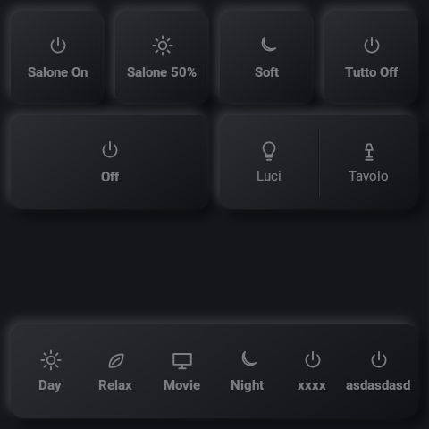
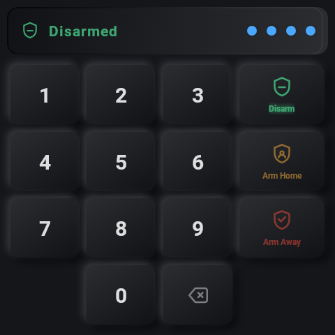
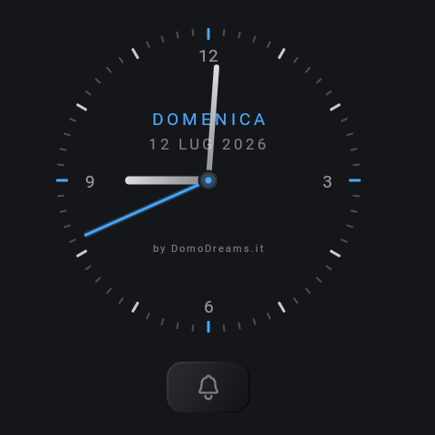
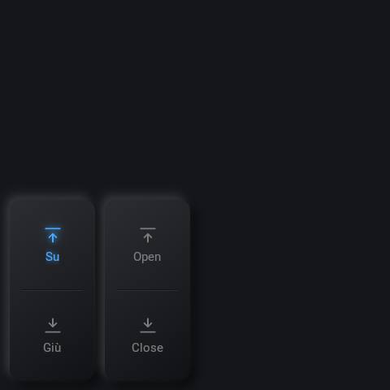
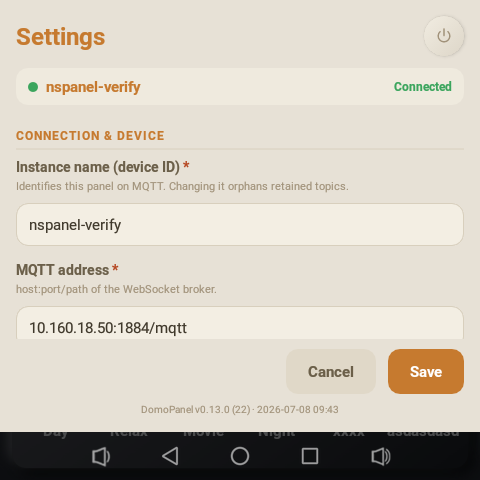

<h1 align="center">DomoDreams Panel</h1>

<p align="center"><b>Turn a Sonoff NSPanel Pro into a gorgeous, fully-custom Home Assistant control panel.</b><br>
Neumorphic buttons, clock, cover &amp; dimmer controls and an alarm keypad — all driven over MQTT, all configured from a visual editor in the HA sidebar.</p>

<p align="center">
  <a href="https://github.com/hacs/integration"></a>
  <a href="LICENSE"></a>
  
  
  
</p>

<p align="center">
  
  
  
</p>

<p align="center"><i>Real screenshots, straight off the panel (480&times;480).</i></p>

---

## Why you'll like it

- 🎛️ **Neumorphic UI that actually looks premium** — soft, pre-rendered surfaces tuned for the NSPanel Pro's low-power GPU. No flat "dashboard on a tablet" look.
- 🧩 **One document, both sides** — a single config describes *look* (pages &amp; tiles) and *behavior* (what each tile does). The panel renders it; the integration executes it.
- 🛰️ **Everything over MQTT** — buttons publish events, the integration mirrors entity state back, and the panel lights up to match. Optimistic on tap, reconciled from real state.
- 🖥️ **Edit it visually** — a config panel lives right in the HA sidebar. Build layouts by clicking, not by hand-editing JSON.
- 🏠 **Multi-panel by design** — one Home Assistant drives *N* panels, each scoped to its own device, entities and topic namespace.
- 🔌 **Local push, zero cloud** — `iot_class: local_push`. Your walls don't phone home.

## What's on the panel

Pages are **typed** and you swipe between them. Mix and match per panel:

<table>
  <tr>
    <td align="center" width="50%"><br><b>Grid</b><br><sub>Neumorphic buttons, split tiles &amp; a scene bar</sub></td>
    <td align="center" width="50%"><br><b>Covers &amp; dimmers</b><br><sub>Tap upper/lower half, long-press to repeat</sub></td>
  </tr>
  <tr>
    <td align="center" width="50%"><br><b>Clock</b><br><sub>Analog or digital, themeable, doubles as a screensaver</sub></td>
    <td align="center" width="50%"><br><b>Alarm</b><br><sub>Full Alarmo keypad — arm, disarm, status</sub></td>
  </tr>
</table>

The panel dims itself on inactivity and wakes on touch or proximity — it owns its own screensaver, so nothing burns in and nothing stays glaring at 3 a.m.

## Install (HACS)

<a href="https://my.home-assistant.io/redirect/hacs_repository/?owner=domodreams&repository=nspanel-pro-home-assistant&category=integration"></a>

1. **HACS → ⋮ → Custom repositories** → add
   `https://github.com/domodreams/nspanel-pro-home-assistant` · category **Integration**.
2. Install **DomoDreams Panel**, then restart Home Assistant.
3. **Settings → Devices &amp; Services → Add Integration → DomoDreams Panel**, and add one entry per panel.
4. Open **NSPanel Pro** in the HA sidebar to lay out your pages.

> Requires the MQTT integration configured in Home Assistant. Each panel connects to the same broker over WebSocket.

## Configure

Everything is edited from the **NSPanel Pro** sidebar panel (admin-only) — pick entities, arrange tiles, choose page types, set the theme. Per-panel device settings (theme, sizes, brightness) can also be tweaked **on the device itself**:

<p align="center"></p>

The layout schema ships with the integration at [`custom_components/domodreams_panel/panels.schema.json`](custom_components/domodreams_panel/panels.schema.json) and is validated on both sides, so a panel and its config can never silently disagree.

## How it works

```
NSPanel Pro (app)  ──MQTT──►  domodreams/panel/{device}/event      (button pressed)
                   ◄─MQTT───   domodreams/panel/{device}/config     (layout + bindings, retained)
                   ◄─MQTT───   domodreams/panel/{device}/state/*    (entity state mirror, retained)
                   ◄─MQTT───   domodreams/panel/{device}/cmd/*      (wake, page, reload, …)
```

- The integration owns the HA side end-to-end: it creates **event entities**, executes **service-call bindings**, and mirrors entity **state** back to the panel. The app never touches HA discovery topics.
- The panel boots from **retained topics + a local cache**, so if the broker or HA is down it still shows your last-known UI.
- Reconnects use exponential backoff with jitter; state is always reconciled from `state/*`.

## The panel app

This integration is free and open source. It pairs with the **DomoDreams Panel** app — a purpose-built React Native kiosk app for the NSPanel Pro (480×480, Android 8.1; immersive fullscreen, keep-awake, autostart on boot). The app is **free to use, with optional premium features**; released builds install over the air from this repo's **Releases**.

## License

The Home Assistant integration in this repository is released under the **MIT License** — see [LICENSE](LICENSE). The companion **DomoDreams Panel** app is a separate product: free to use, with some features available as a premium unlock.

---

<p align="center"><sub>Made with ♥ by <b>DomoDreams</b> · for the Sonoff NSPanel Pro · not affiliated with Sonoff/ITEAD or Home Assistant.</sub></p>
