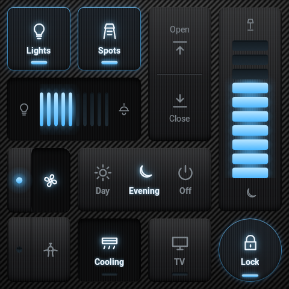
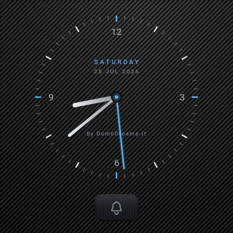
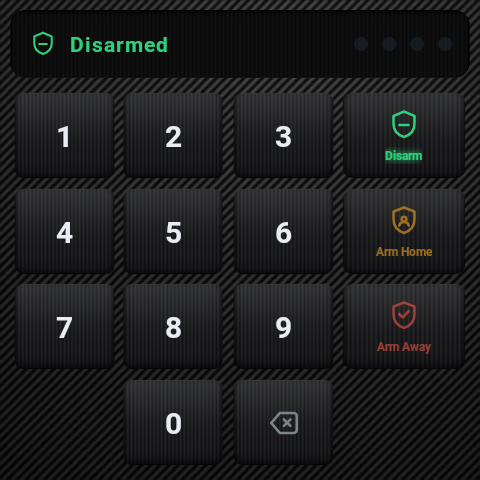
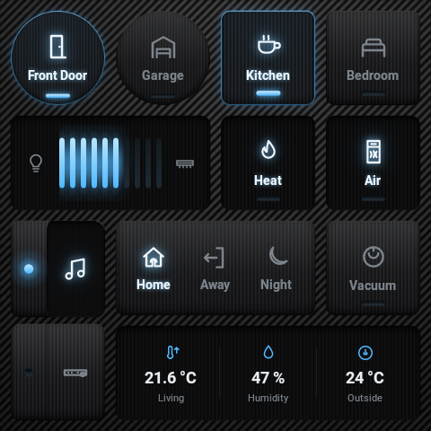
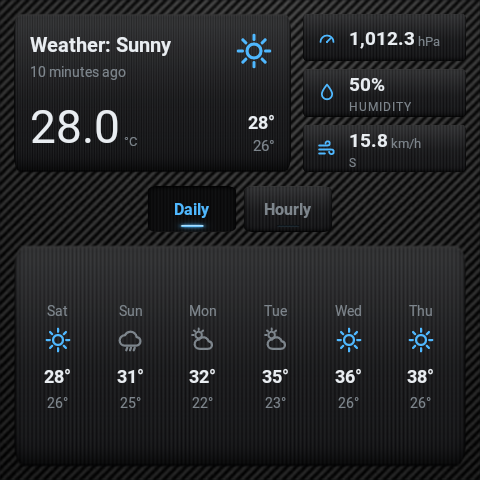
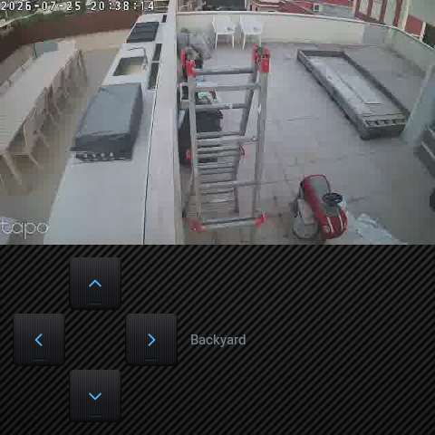
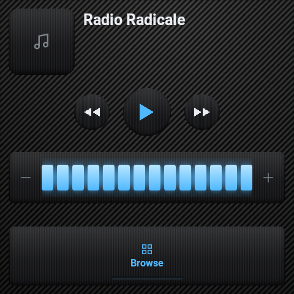
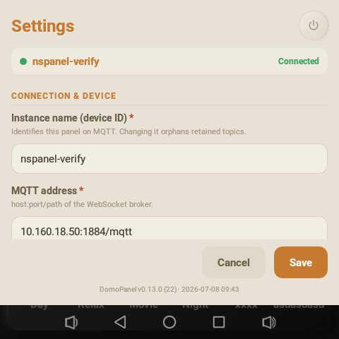

<h1 align="center">DomoDreams NSPanel Pro</h1>

<p align="center"><b>Turn a Sonoff NSPanel Pro into a gorgeous, fully-custom Home Assistant control panel.</b><br>
Soft, tactile controls with real depth — buttons, dimmers, covers, a clock, weather, live camera, music and an alarm keypad — all driven over MQTT, all laid out from a visual editor right in the Home Assistant sidebar.</p>

<p align="center">
  <a href="https://nspanel.domodreams.it"></a>
  <a href="https://github.com/hacs/integration"></a>
  
  
  
  <a href="LICENSE"></a>
</p>

<p align="center">
  
  
  
</p>

<p align="center"><i>Real screenshots, straight off the panel (480&times;480) — here in the <b>Carbon Weave</b> theme.</i></p>

<p align="center"><b>🌐 See the living gallery — 30+ themes, every page — at <a href="https://nspanel.domodreams.it">nspanel.domodreams.it</a></b></p>

---

## Why you'll like it

- 🎛️ **A control surface that looks premium** — soft, sculpted, pre-rendered surfaces tuned for the NSPanel Pro's low-power GPU. Buttons you can almost feel, not a flat "dashboard on a tablet".
- 🎨 **30+ themes, one tap apart** — carbon fibre, warm wood, brushed metal, calm minimal, bold neon. Re-skin the whole panel from Home Assistant; the look is the panel's, not a compromise.
- 🧩 **One document, both sides** — a single config describes *look* (pages & tiles) and *behaviour* (what each tile does). The panel renders it; the integration executes it.
- 🖥️ **Edit it visually** — a config panel lives in the HA sidebar. Build layouts by clicking, not by hand-editing JSON — with a live screenshot of the real panel as you work.
- 🛰️ **Everything over MQTT** — buttons publish events, the integration mirrors entity state back, and the panel lights up to match. Optimistic on tap, reconciled from real state.
- 🏠 **Multi-panel by design** — one Home Assistant drives *N* panels, each scoped to its own device, entities and topic namespace.
- 🔌 **Local push, zero cloud** — `iot_class: local_push`. Your walls don't phone home.

## What's on the panel

Pages are **typed** and you swipe between them — mix and match per panel:

<table>
  <tr>
    <td align="center" width="33%"><br><b>Rooms &amp; scenes</b><br><sub>Circle buttons, split tiles, dimmers &amp; a scene bar</sub></td>
    <td align="center" width="33%"><br><b>Clock</b><br><sub>Analog or digital — doubles as the screensaver</sub></td>
    <td align="center" width="33%"><br><b>Weather</b><br><sub>Conditions + forecast from any HA weather entity</sub></td>
  </tr>
  <tr>
    <td align="center" width="33%"><br><b>Alarm</b><br><sub>Full Alarmo keypad — arm, disarm, live status</sub></td>
    <td align="center" width="33%"><br><b>Camera</b><br><sub>Live MJPEG view with a pan/tilt D-pad</sub></td>
    <td align="center" width="33%"><br><b>Music</b><br><sub>Music Assistant browser — the panel becomes a speaker</sub></td>
  </tr>
</table>

Plus a **text** readout tile for live sensor values, and covers/dimmers you drive by tapping the upper/lower half (long-press to repeat). The panel dims itself on inactivity and wakes on touch or proximity — it owns its own screensaver, so nothing burns in and nothing glares at 3 a.m.

## Every page, any theme

The same grid, re-skinned end to end — here in four more of the built-in themes:

<p align="center">
  
  
  
  
</p>

<p align="center"><b><a href="https://nspanel.domodreams.it">▶ Browse the full gallery &amp; theme studio →</a></b></p>

## Install (HACS)

<a href="https://my.home-assistant.io/redirect/hacs_repository/?owner=domodreams&repository=home-assistant-nspanel-pro&category=integration"></a>

1. **HACS → ⋮ → Custom repositories** → add
   `https://github.com/domodreams/home-assistant-nspanel-pro` · category **Integration**.
2. Install the **DomoDreams Panel** integration, then restart Home Assistant.
3. **Settings → Devices &amp; Services → Add Integration → DomoDreams Panel**, and add one entry per panel.
4. Open **NSPanel Pro** in the HA sidebar to lay out your pages.

> Requires the MQTT integration configured in Home Assistant. Each panel connects to the same broker over WebSocket.

The panel app itself installs from this repo's **[Releases](../../releases)** (see [The panel app](#the-panel-app)).

## Configure

Everything is edited from the **NSPanel Pro** sidebar panel (admin-only) — pick entities, arrange tiles, choose page types, set the theme, all with a live preview of the real panel. Per-panel device settings (theme, sizes, brightness, clock) can also be tweaked **on the device itself**:

<p align="center"></p>

The layout schema ships with the integration at [`custom_components/domodreams_panel/panels.schema.json`](custom_components/domodreams_panel/panels.schema.json) and is validated on both sides, so a panel and its config can never silently disagree.

## How it works

```
NSPanel Pro (app)  ──MQTT──►  domodreams/panel/{device}/event      (button pressed)
                   ◄─MQTT───   domodreams/panel/{device}/config     (layout + bindings, retained)
                   ◄─MQTT───   domodreams/panel/{device}/state/*    (entity state mirror, retained)
                   ◄─MQTT───   domodreams/panel/{device}/cmd/*      (wake, page, reload, …)
```

- The integration owns the HA side end to end: it creates **event entities**, executes **service-call bindings**, and mirrors entity **state** back to the panel. The app never touches HA discovery topics.
- The panel boots from **retained topics + a local cache**, so if the broker or HA is down it still shows your last-known UI.
- Reconnects use exponential backoff with jitter; state is always reconciled from `state/*`.

## Free &amp; Pro

The integration is **free and open source (MIT)**. The companion **DomoDreams NSPanel Pro** app is free to use, with an optional per-panel unlock:

| | Free | Pro |
|---|:---:|:---:|
| Every page type &amp; all themes | ✓ | ✓ |
| Visual editor · multi-panel · OTA updates | ✓ | ✓ |
| On-screen watermark | shown | **removed** |
| Per-panel licence | — | ✓ |

## The panel app

This integration pairs with **DomoDreams NSPanel Pro** — a purpose-built React Native kiosk app for the Sonoff NSPanel Pro (480×480, Android 8.1; immersive fullscreen, keep-awake, portrait lock, autostart on boot). It is **free to use, with the optional Pro unlock** above; released builds are attached to this repo's **[Releases](../../releases)** and install over the air.

## License

This repository ships components under **different** licenses — see [LICENSE](LICENSE):

- **Home Assistant integration** (`custom_components/domodreams_panel/`) — **MIT**.
- **DomoDreams NSPanel Pro app** (the Android APK in Releases) and the **brand assets / screenshots** — **proprietary**, © DomoDreams. Free to install and run; not open source.

---

<p align="center"><sub>Made with ♥ by <b><a href="https://nspanel.domodreams.it">DomoDreams</a></b> · for the Sonoff NSPanel Pro · not affiliated with Sonoff/ITEAD or Home Assistant.</sub></p>
